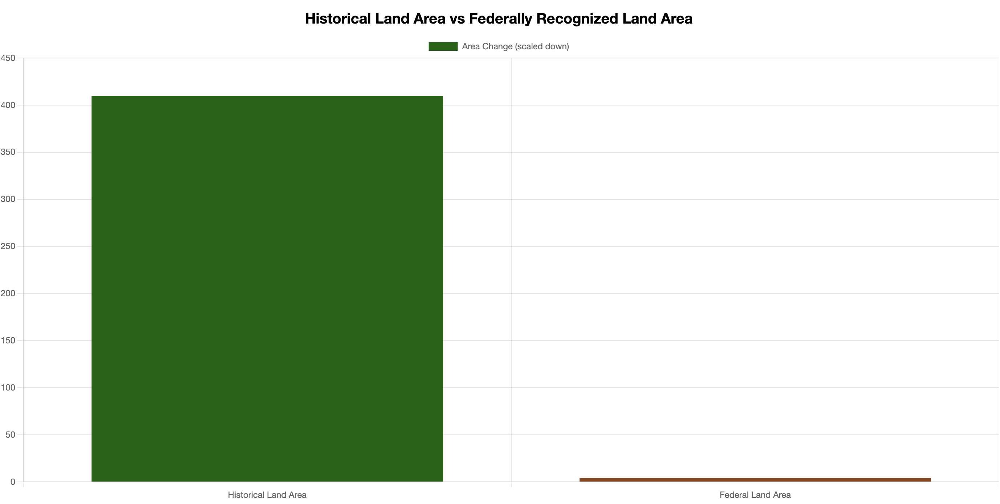

# Visualizing Populations of Indigenous California Tribes 
***Project Description***: Full-stack data visualization web application to interactively explore a dataset using a multi-layered map.

## Process
1. The data was sourced from https://gis.data.ca.gov/datasets/CAEnergy::federally-recognized-tribal-lands/about and 
https://hub.arcgis.com/datasets/univredlands::historic-native-american-territories-in-california-1/about. The data was extracted from these geoJSON files. 

2. After extracting the data, transform the data using ipynb notebook. Create pandas dataframes with relevant columns and change coordinates to strings. Then, load the data into a master SQLite database that has tables for the missions, estancias, asitancias, reservations, federal land, and historical land.

3. Use javascript to create a base map using open street map. Use functions to create layers for the missions, estancias, and asistancias that will show them on the map, and have informational popups.

4. Create an index.html file that will house the code for the home page. This will contain the scripts that your javascript files will use as well as call your javascript files.

5. Create a bar chart to visualize the difference in total land area from the historical data and the federally recognized data. Use Chart.js to create this visualization. 

## Software/Libraries Used
Juptyer Notebook, D3, Javascript, Chart.js, sqlalchemy, flask

## Sources
https://gis.data.ca.gov/datasets/CAEnergy::federally-recognized-tribal-lands/about

https://hub.arcgis.com/datasets/univredlands::historic-native-american-territories-in-california-1/about

https://cdn.jsdelivr.net/npm/chart.js@4.2.1/dist/chart.umd.min.js

https://nahc.ca.gov/

http://www.wherearethechildren.ca 

https://www.openstreetmap.org/copyright

